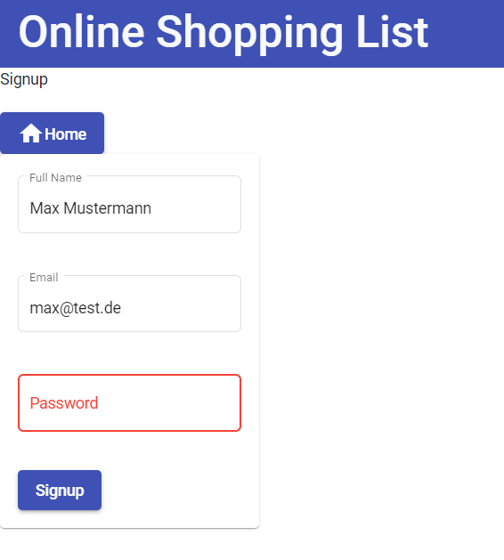
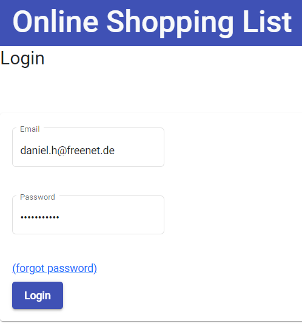
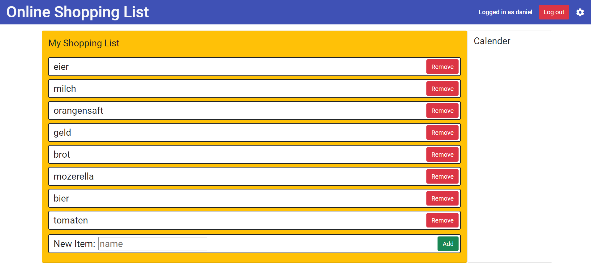

# Online shopping list
A small application to create online shopping lists 
using [Angular](https://angular.io/), [Bootstrap](https://getbootstrap.com/) and [Firebase](https://firebase.google.com).
Users can create an account or login in their existing account where
they can access and edit their individual shopping list.

The user authentification is done using [Firebase auth](https://firebase.google.com/products/auth) 

The user details and their shopping list items 
are stored using the [Firebase firestore](https://firebase.google.com/products/firestore).

Signup and verify your email.  

Login with your userdata or reset the password with your email.

Edit your personal shopping list.

## Development server

Run `ng serve` for a dev server. Navigate to `http://localhost:4200/`. The app will automatically reload if you change any of the source files.

## Code scaffolding

Run `ng generate component component-name` to generate a new component. You can also use `ng generate directive|pipe|service|class|guard|interface|enum|module`.

## Build

Run `ng build` to build the project. The build artifacts will be stored in the `dist/` directory.

## Running unit tests

Run `ng test` to execute the unit tests via [Karma](https://karma-runner.github.io).

## Running end-to-end tests

Run `ng e2e` to execute the end-to-end tests via a platform of your choice. To use this command, you need to first add a package that implements end-to-end testing capabilities.

## Further help

To get more help on the Angular CLI use `ng help` or go check out the [Angular CLI Overview and Command Reference](https://angular.io/cli) page.
